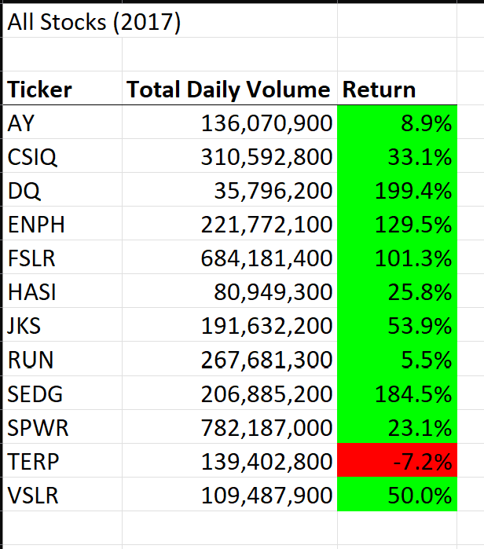
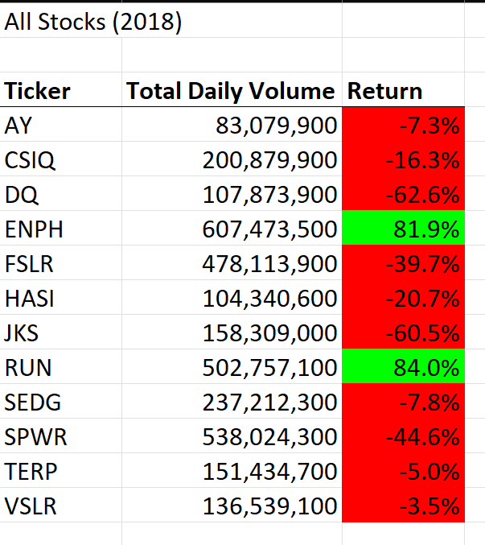
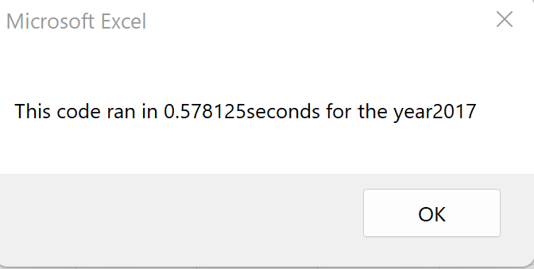
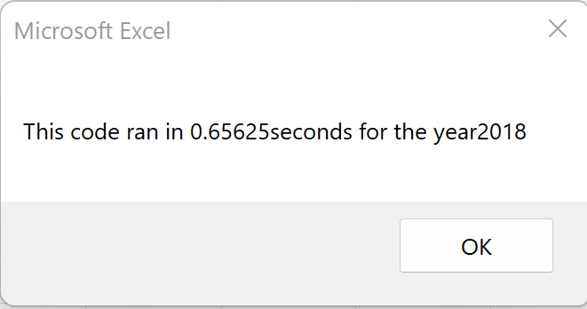
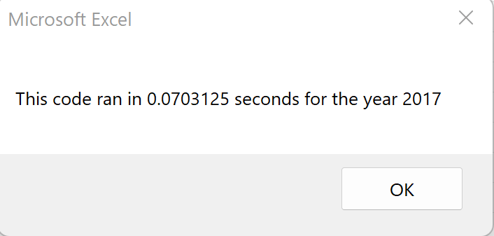
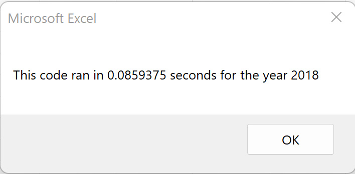

# stock-analysis
## Overview of Project
This project focuses on helping Steve assist his parents in choosing the most beneficial green-energy stock to invest in. In this analysis, we refactor VBA code to better analyze and draw solutions from a dataset spanning over two years of several stocks. We will discuss the benefits and shortcomings of refactoring code and its application to this project's VBA script.
## Results
### Stock Analysis
The data compares the performance of 12 different stocks between the years 2017 and 2018. There are significant differences in the analysis between the two years- most visibly, the significant drop in results for most of the green-energy stock in 2018. It is clear that in both years, the stocks for ENPH and RUN provided the highest return possible.
   
   
 ### Refactored Script Results
 The original script was slightly less efficient than the refactored one in running the stock analysis. For 2017, the original script took approximate .58 seconds.
    
 The 2018 results took slightly longer with approximately .65 seconds. 
    
 The Refactored code showed much faster results. This VBA script was refactored to add significant loops and conditions to simplify the process and allow for future changes and applications, should they be necessary. The 2017 and 2018 results are shown below:
    
    
 ## Summary
 ### Advantages and Disadvantages of Refactoring Code
 The most significant advantage of refactoring code is that it proves to be more legible to the next reader. This allows someone new to understand the logic behind the script but also to keep to the format and make changes if they are necessary. Another advantage is that refactored code is concise which allows the system to process dta faster with clearer instructions. This speedy change is noticeable in the timestamps above in which the refactored code took less than  .1 seconds to process data and provide output summary than the original script.
 A Disadvantage would be the time that it takes to refactor a script. Editing can take time, especially if errors or syntax mistakes prove frustrating and time-consuming. If running the original code as is proves more useful to meet the deadline, then refactoring may slow down the process.
The original VBA script was functional but somewhat messy. By refactoring this code, the script was made cleaner and therefore easier to work with and adapt if some aspects of it would prove useful for another project in the future. As mentioned earler, refactoring was a significant advantage in run time speed.
